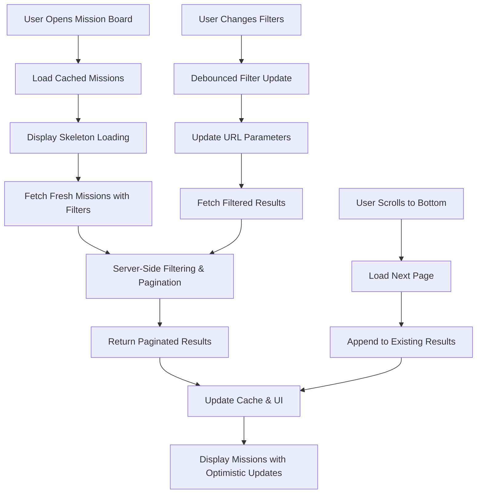
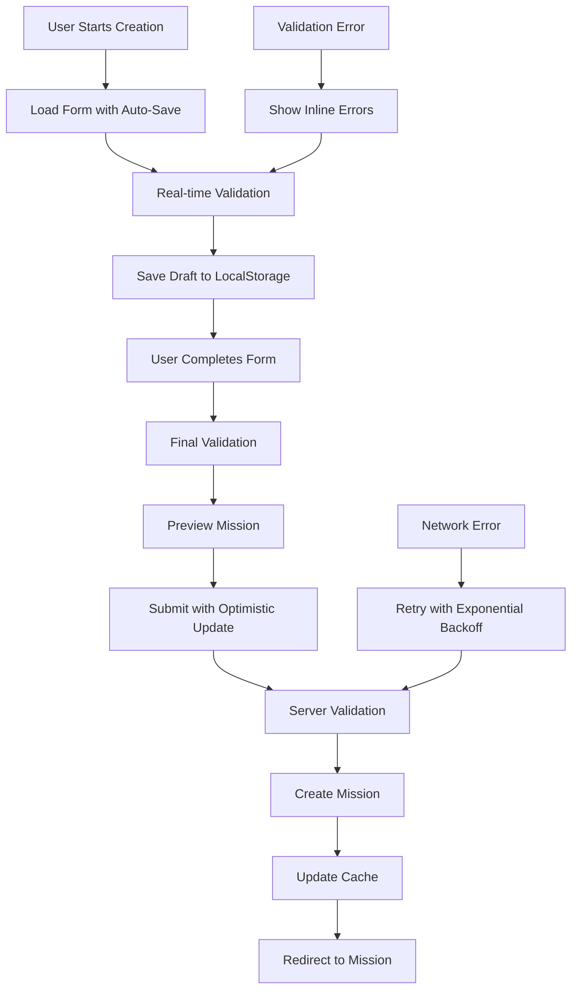

# Mission System Enhancement Design

## Architecture Overview

### Core Principles Implementation

#### ENHANCEMENT FIRST
- Extend existing components with new capabilities
- Enhance current API endpoints with additional parameters
- Build upon React Query patterns with optimizations

#### AGGRESSIVE CONSOLIDATION
- Merge duplicate validation logic into shared services
- Consolidate token access patterns
- Unify error handling across all components

#### PREVENT BLOAT
- Remove unused component props and deprecated patterns
- Streamline component interfaces
- Eliminate redundant state management

## System Architecture

### Enhanced Component Hierarchy

```
MissionSystem/
├── containers/
│   ├── MissionBoard/                    # Enhanced main container
│   │   ├── index.tsx                   # Main board component
│   │   ├── MissionBoard.hooks.ts       # Custom hooks
│   │   ├── MissionBoard.types.ts       # Type definitions
│   │   └── MissionBoard.test.tsx       # Unit tests
│   │
│   ├── MissionCreation/                # Enhanced creation flow
│   │   ├── index.tsx                   # Main creation component
│   │   ├── MissionCreationForm/        # Form components
│   │   ├── MissionTemplates/           # Template selection
│   │   └── MissionPreview/             # Preview before publish
│   │
│   └── MissionManagement/              # New creator dashboard
│       ├── index.tsx                   # Dashboard component
│       ├── MissionAnalytics/           # Performance metrics
│       └── MissionBulkActions/         # Batch operations
│
├── components/                         # Reusable UI components
│   ├── MissionCard/                    # Enhanced mission display
│   │   ├── index.tsx                   # Main card component
│   │   ├── MissionCard.variants.ts     # Card variations
│   │   ├── MissionCard.hooks.ts        # Card-specific hooks
│   │   └── MissionCard.test.tsx        # Unit tests
│   │
│   ├── MissionFilters/                 # Enhanced filtering
│   │   ├── index.tsx                   # Main filter component
│   │   ├── FilterPresets/              # Saved filter presets
│   │   └── AdvancedFilters/            # Advanced filter options
│   │
│   ├── MissionSearch/                  # New search component
│   │   ├── index.tsx                   # Search interface
│   │   ├── SearchSuggestions/          # Auto-complete
│   │   └── SearchHistory/              # Recent searches
│   │
│   └── shared/                         # Shared UI components
│       ├── LoadingStates/              # Skeleton loaders
│       ├── ErrorBoundaries/            # Error handling
│       └── OptimisticUI/               # Optimistic updates
│
├── services/                           # Business logic layer
│   ├── MissionService/                 # Enhanced mission operations
│   │   ├── index.ts                    # Main service interface
│   │   ├── MissionValidator.ts         # Centralized validation
│   │   ├── MissionCache.ts             # Caching strategies
│   │   └── MissionAnalytics.ts         # Analytics integration
│   │
│   ├── TokenAccessService/             # Consolidated token logic
│   │   ├── index.ts                    # Main service
│   │   ├── TokenValidator.ts           # Balance validation
│   │   └── TokenCache.ts               # Balance caching
│   │
│   └── ErrorService/                   # Centralized error handling
│       ├── index.ts                    # Error service
│       ├── ErrorClassifier.ts          # Error categorization
│       └── ErrorReporter.ts            # Error reporting
│
├── hooks/                              # Custom React hooks
│   ├── queries/                        # React Query hooks
│   │   ├── useMissions.ts              # Enhanced mission queries
│   │   ├── useMissionCreation.ts       # Creation mutations
│   │   ├── useMissionManagement.ts     # Management operations
│   │   └── useTokenAccess.ts           # Token access queries
│   │
│   ├── forms/                          # Form management hooks
│   │   ├── useMissionForm.ts           # Mission form logic
│   │   ├── useFormValidation.ts        # Validation hooks
│   │   └── useFormAutoSave.ts          # Auto-save functionality
│   │
│   └── ui/                             # UI-specific hooks
│       ├── useOptimisticUpdates.ts     # Optimistic UI
│       ├── useInfiniteScroll.ts        # Pagination
│       └── useKeyboardNavigation.ts    # Accessibility
│
├── types/                              # Type definitions
│   ├── mission.types.ts                # Mission-related types
│   ├── api.types.ts                    # API response types
│   ├── ui.types.ts                     # UI component types
│   └── shared.types.ts                 # Shared type definitions
│
└── utils/                              # Utility functions
    ├── validation/                     # Validation utilities
    ├── formatting/                     # Data formatting
    ├── caching/                        # Cache utilities
    └── performance/                    # Performance helpers
```

## Enhanced Data Flow

### Mission Discovery Flow



### Mission Creation Flow



## Service Layer Design

### MissionService Enhancement

```typescript
interface EnhancedMissionService {
  // Enhanced query methods
  getMissions(params: MissionQueryParams): Promise<PaginatedMissions>;
  searchMissions(query: string, filters?: MissionFilters): Promise<Mission[]>;
  getMissionById(id: string, includeAnalytics?: boolean): Promise<MissionWithAnalytics>;
  
  // Batch operations
  acceptMissions(missionIds: string[], userId: string): Promise<BatchResult>;
  bulkCreateMissions(missions: CreateMissionInput[]): Promise<BatchResult>;
  
  // Analytics and insights
  getMissionAnalytics(missionId: string): Promise<MissionAnalytics>;
  getCreatorInsights(creatorId: string): Promise<CreatorInsights>;
  
  // Template operations
  getMissionTemplates(category?: string): Promise<MissionTemplate[]>;
  createFromTemplate(templateId: string, customizations: Partial<Mission>): Promise<Mission>;
  
  // Cache management
  invalidateCache(pattern?: string): Promise<void>;
  warmCache(missionIds: string[]): Promise<void>;
}

interface MissionQueryParams {
  page?: number;
  limit?: number;
  difficulty?: MissionDifficulty[];
  topics?: string[];
  languages?: string[];
  status?: MissionStatus[];
  sortBy?: 'newest' | 'reward' | 'participants' | 'trending';
  search?: string;
  createdBy?: string;
  minReward?: number;
  maxReward?: number;
  locationBased?: boolean;
}

interface PaginatedMissions {
  missions: Mission[];
  pagination: {
    page: number;
    limit: number;
    total: number;
    totalPages: number;
    hasNext: boolean;
    hasPrev: boolean;
  };
  filters: AppliedFilters;
  aggregations: {
    totalRewards: number;
    averageReward: number;
    difficultyDistribution: Record<MissionDifficulty, number>;
    topicDistribution: Record<string, number>;
  };
}
```

### TokenAccessService Consolidation

```typescript
interface TokenAccessService {
  // Consolidated balance checking
  getTokenBalances(address: string): Promise<TokenBalances>;
  validateCreatorEligibility(address: string): Promise<EligibilityResult>;
  validateMissionAccess(address: string, mission: Mission): Promise<AccessResult>;
  
  // Caching and optimization
  getCachedBalance(address: string, tokenAddress: string): TokenBalance | null;
  refreshBalances(addresses: string[]): Promise<void>;
  
  // Tier management
  getUserTier(address: string): Promise<TokenTier>;
  getTierBenefits(tier: TokenTier): TierBenefits;
  
  // Batch operations
  validateBulkEligibility(addresses: string[]): Promise<Record<string, EligibilityResult>>;
}

interface TokenBalances {
  papajams: bigint;
  voisss: bigint;
  lastUpdated: Date;
  tier: TokenTier;
  eligibility: {
    canCreateMissions: boolean;
    canAcceptMissions: boolean;
    maxMissionsPerDay: number;
    premiumFeatures: string[];
  };
}
```

### ErrorService Implementation

```typescript
interface ErrorService {
  // Error classification
  classifyError(error: unknown): ClassifiedError;
  
  // Error handling strategies
  handleApiError(error: ApiError): ErrorHandlingResult;
  handleValidationError(error: ValidationError): ErrorHandlingResult;
  handleNetworkError(error: NetworkError): ErrorHandlingResult;
  
  // User-friendly messaging
  getErrorMessage(error: ClassifiedError): string;
  getErrorActions(error: ClassifiedError): ErrorAction[];
  
  // Reporting and analytics
  reportError(error: ClassifiedError, context: ErrorContext): void;
  getErrorMetrics(): ErrorMetrics;
}

interface ClassifiedError {
  type: 'validation' | 'network' | 'authorization' | 'server' | 'client';
  severity: 'low' | 'medium' | 'high' | 'critical';
  code: string;
  message: string;
  details?: Record<string, any>;
  retryable: boolean;
  userActionRequired: boolean;
}
```

## API Enhancement Design

### Unified Response Format

```typescript
interface ApiResponse<T = any> {
  success: boolean;
  data?: T;
  error?: {
    code: string;
    message: string;
    details?: Record<string, any>;
    field?: string; // For validation errors
  };
  meta?: {
    timestamp: string;
    requestId: string;
    version: string;
  };
  pagination?: PaginationMeta;
}

interface PaginationMeta {
  page: number;
  limit: number;
  total: number;
  totalPages: number;
  hasNext: boolean;
  hasPrev: boolean;
}
```

### Enhanced API Endpoints

```typescript
// GET /api/missions - Enhanced with server-side filtering
interface MissionsEndpoint {
  query: MissionQueryParams;
  response: ApiResponse<PaginatedMissions>;
}

// POST /api/missions/create - Enhanced with validation
interface CreateMissionEndpoint {
  body: CreateMissionRequest;
  response: ApiResponse<Mission>;
}

// POST /api/missions/batch-accept - New batch operation
interface BatchAcceptEndpoint {
  body: {
    missionIds: string[];
    userId: string;
  };
  response: ApiResponse<BatchResult>;
}

// GET /api/missions/analytics/:id - New analytics endpoint
interface MissionAnalyticsEndpoint {
  params: { id: string };
  response: ApiResponse<MissionAnalytics>;
}
```

## Performance Optimization Strategy

### Caching Architecture

```typescript
interface CacheStrategy {
  // Multi-level caching
  levels: {
    memory: MemoryCache;      // In-memory for immediate access
    localStorage: LocalCache;  // Browser storage for persistence
    cdn: CDNCache;            // CDN for static assets
    database: DatabaseCache;   // Database query caching
  };
  
  // Cache invalidation
  invalidation: {
    timeBasedTTL: number;     // Time-based expiration
    eventBased: string[];     // Event-triggered invalidation
    versionBased: string;     // Version-based cache busting
  };
  
  // Cache warming
  warming: {
    popular: boolean;         // Pre-load popular missions
    userBased: boolean;       // Pre-load user-specific data
    predictive: boolean;      // Predictive pre-loading
  };
}
```

### Component Optimization

```typescript
// Memoized mission card with selective re-rendering
const MissionCard = React.memo(({ mission, userTier, onAccept }: MissionCardProps) => {
  const memoizedReward = useMemo(() => 
    formatReward(mission.baseReward, mission.difficulty), 
    [mission.baseReward, mission.difficulty]
  );
  
  const memoizedEligibility = useMemo(() => 
    checkEligibility(mission, userTier), 
    [mission.requiredTier, userTier]
  );
  
  return (
    <Card>
      {/* Optimized rendering */}
    </Card>
  );
}, (prevProps, nextProps) => {
  // Custom comparison for selective re-rendering
  return (
    prevProps.mission.id === nextProps.mission.id &&
    prevProps.userTier === nextProps.userTier &&
    prevProps.mission.currentParticipants === nextProps.mission.currentParticipants
  );
});
```

### Query Optimization

```typescript
// Optimized React Query configuration
const missionQueryConfig = {
  staleTime: 5 * 60 * 1000,        // 5 minutes
  cacheTime: 30 * 60 * 1000,       // 30 minutes
  refetchOnWindowFocus: false,      // Prevent unnecessary refetches
  refetchOnReconnect: true,         // Refetch on network reconnect
  retry: (failureCount, error) => {
    // Smart retry logic based on error type
    if (error.status === 404) return false;
    return failureCount < 3;
  },
  select: (data) => {
    // Transform data to minimize re-renders
    return data.missions.map(mission => ({
      ...mission,
      formattedReward: formatReward(mission.baseReward),
      timeRemaining: calculateTimeRemaining(mission.expiresAt),
    }));
  },
};
```

## UI/UX Enhancement Design

### Progressive Loading Strategy

```typescript
interface LoadingStrategy {
  skeleton: {
    missionCard: SkeletonMissionCard;
    missionList: SkeletonMissionList;
    missionForm: SkeletonMissionForm;
  };
  
  progressive: {
    criticalContent: 'immediate';    // Load immediately
    aboveFold: 'priority';          // Load with high priority
    belowFold: 'lazy';              // Lazy load when needed
    images: 'intersection';         // Load on intersection
  };
  
  optimistic: {
    mutations: OptimisticUpdateConfig;
    navigation: OptimisticNavigationConfig;
  };
}
```

### Responsive Design System

```typescript
interface ResponsiveDesign {
  breakpoints: {
    mobile: '320px - 768px';
    tablet: '768px - 1024px';
    desktop: '1024px+';
  };
  
  layouts: {
    missionGrid: {
      mobile: '1 column';
      tablet: '2 columns';
      desktop: '3-4 columns';
    };
    
    missionCard: {
      mobile: 'compact vertical';
      tablet: 'standard horizontal';
      desktop: 'detailed horizontal';
    };
  };
  
  interactions: {
    touch: TouchInteractionConfig;
    keyboard: KeyboardNavigationConfig;
    mouse: MouseInteractionConfig;
  };
}
```

## Testing Strategy

### Component Testing

```typescript
interface TestingStrategy {
  unit: {
    components: 'React Testing Library';
    hooks: 'React Hooks Testing Library';
    services: 'Jest with mocks';
    utilities: 'Jest unit tests';
  };
  
  integration: {
    apiEndpoints: 'Supertest with test database';
    userFlows: 'Cypress component tests';
    serviceIntegration: 'Jest integration tests';
  };
  
  e2e: {
    criticalPaths: 'Playwright end-to-end';
    crossBrowser: 'BrowserStack integration';
    performance: 'Lighthouse CI';
  };
  
  coverage: {
    minimum: '80%';
    critical: '95%';
    excludes: ['types', 'constants', 'mocks'];
  };
}
```

## Migration Strategy

### Phase 1: Foundation (Weeks 1-2)
- Implement unified API response format
- Create centralized validation service
- Set up enhanced error handling
- Establish caching infrastructure

### Phase 2: Core Enhancements (Weeks 3-4)
- Enhance MissionBoard with server-side filtering
- Implement optimized MissionCard with memoization
- Add pagination and infinite scroll
- Create consolidated TokenAccessService

### Phase 3: Advanced Features (Weeks 5-6)
- Implement mission templates and bulk operations
- Add analytics and insights dashboard
- Create advanced search and filtering
- Implement auto-save and form enhancements

### Phase 4: Optimization (Weeks 7-8)
- Performance optimization and monitoring
- Comprehensive testing and bug fixes
- Documentation and training materials
- Production deployment and monitoring

## Success Metrics and Monitoring

### Performance Metrics
- Page load time: < 2 seconds
- Time to interactive: < 3 seconds
- Bundle size reduction: 20%
- API response time: < 200ms (95th percentile)

### User Experience Metrics
- Mission creation completion rate: > 90%
- Form abandonment rate: < 10%
- User satisfaction score: > 4.5/5
- Mobile usage completion rate: > 85%

### Business Metrics
- Mission creation volume: +25%
- User engagement: +30% DAU increase
- Creator retention: +15%
- Platform revenue: +20%